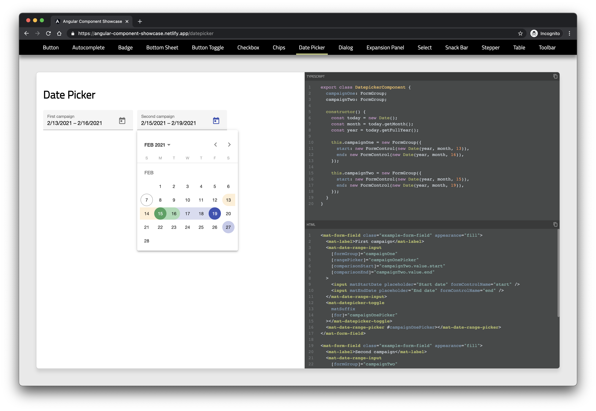

# Angular Component Showcase

The purpose of this project is to demonstrate how to setup a local component showcase system capable of rendering a live dynamic component alongside its source code. This example also includes the ability to copy the source code directly from the demo page.
[Live demo](https://angular-component-showcase.netlify.app).

For this example, the Material Angular components are used, but any component can be showcased in their place. This would be especially useful for a mono-repo with many small shared components that a team needs to be aware of.

## Problem solved

This solves the problem of having to maintain the component demo along with separate string representations of that components source code which are then displayed. Instead, in this way the component is rendered and the source code is automatically parsed and displayed alongside it.
